# Let's Draw

Let's Draw turns spoken or typed ideas into editable diagrams.

It runs mostly in the browser. Diagrams are stored locally, and the server only handles diagram generation requests.

## Stack

- Next.js
- React and TypeScript
- Excalidraw for the drawing canvas
- Dexie and IndexedDB for local storage
- Web Speech API for voice input
- Gemini or Sarvam AI providers

## Architecture

This diagram shows one complete request from input to saved diagram.

```mermaid
%%{init: {"theme": "base", "themeVariables": {"background": "#ffffff", "fontFamily": "Kalam, Comic Sans MS, cursive", "fontSize": "15px", "primaryTextColor": "#172033", "lineColor": "#64748b", "primaryBorderColor": "#2563eb"}}}%%
flowchart LR
    Start([START<br/>Open app]) --> Input[Voice or typed input]
    Input --> Browser[Browser editor]
    Browser --> API[Next.js API route]
    API --> Validate[Validate request]
    Validate --> Prompt[Build AI prompt]
    Prompt --> Provider{Gemini<br/>or Sarvam}
    Provider --> Graph[Graph response]
    Graph --> Layout[Layout nodes<br/>and edges]
    Layout --> Canvas[Excalidraw canvas]
    Canvas --> Store[(IndexedDB<br/>local storage)]
    Store --> End([END<br/>Saved locally])
    Validate -. invalid .-> Error([END<br/>Clear error])
    Provider -. failed .-> Error

    classDef endpoint fill:#dcfce7,stroke:#166534,stroke-width:3px,color:#14532d;
    classDef browser fill:#dbeafe,stroke:#1d4ed8,stroke-width:2px,color:#172554;
    classDef server fill:#fef3c7,stroke:#b45309,stroke-width:2px,color:#451a03;
    classDef provider fill:#fce7f3,stroke:#be185d,stroke-width:2px,color:#500724;
    class Start,End,Error endpoint;
    class Input,Browser,Canvas,Store browser;
    class API,Validate,Prompt,Graph,Layout server;
    class Provider provider;
```



The flow is simple: the browser collects an instruction, the server asks Gemini or Sarvam for a graph, the server lays out the graph, and the browser draws and saves it.

## Code map

| Area | Location |
| --- | --- |
| Pages and routes | `src/app/` |
| Editor components | `src/components/editor/` |
| Library components | `src/components/library/` |
| React hooks | `src/hooks/` |
| AI and prompts | `src/lib/ai/` |
| Database | `src/lib/db.ts` |
| Graph layout and icons | `src/lib/render/` |
| Import and export | `src/lib/io/` |
| Shared types | `src/types/` |

## Install

```bash
npm install
```

## Environment

Create `.env.local` from `.env.example`. Server-side AI keys are optional because users can provide their own keys in Settings.

- `GEMINI_API_KEY`
- `SARVAM_API_KEY`
- `NEXT_PUBLIC_BASE_URL`

Never commit `.env.local` or server-side API keys.

## Development

```bash
npm run dev
```

Open `http://localhost:3000`.

## Production

Build and run the production server locally:

```bash
npm run build
npm start
```

Open `http://localhost:3000` after the server starts.

## Checks

```bash
npm run lint
npx tsc --noEmit
npm run build
```

The application stores diagrams locally in the browser. Clearing browser data can remove local diagrams, so export important work as a backup.

## License

This project is licensed under the MIT License.
